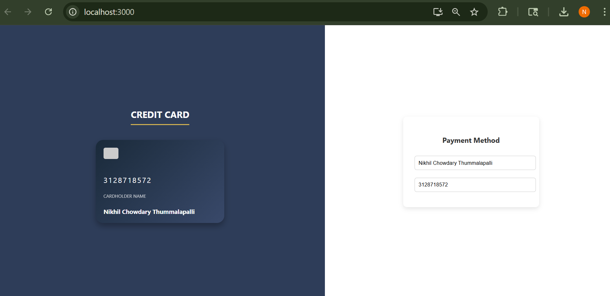

#Credit Card Display - React App

This is a simple React application that dynamically displays a credit card layout as the user types in their **Card Number** and **Cardholder Name**.





# Features

- Live update of credit card number and name

---

##  Getting Started

### 1. Clone the Repository

```bash
git clone https://github.com/tnikhilchowdary/credit-card-display.git
cd credit-card-display

